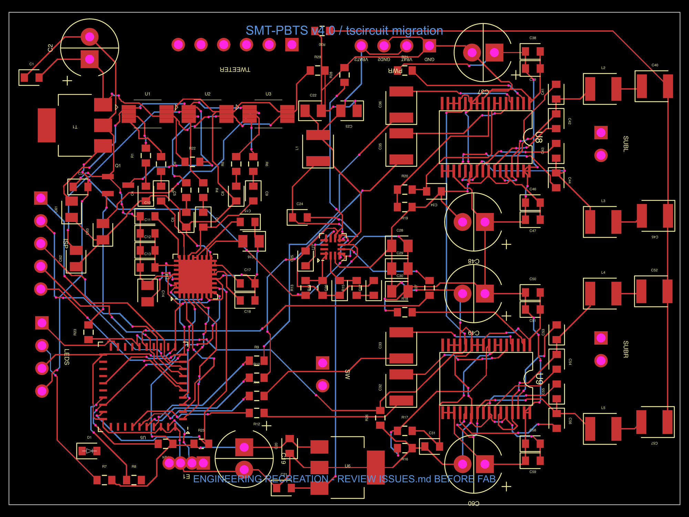
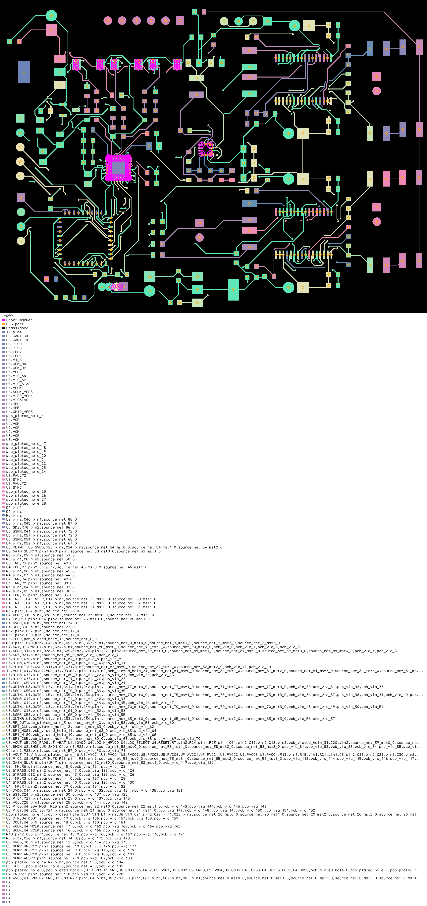

# High-priority engineering issues

Review date: 2026-09-24

Scope: original SMT-PBTS v4.0 EasyEDA sources plus the new tscircuit migration in `tscircuit/`.

## Status summary

| Priority | Finding | Release impact |
| --- | --- | --- |
| P0 | The tscircuit migration is not fabrication-ready | Blocks Gerber/BOM release from tscircuit |
| P1 | The 5 V linear rail needs a thermal/current budget | Blocks confident full-power operation |
| P1 | The 3.3 V regulator is marked obsolete in the project BOM | Blocks a repeatable production BOM |
| P1 | Battery/input protection is external and not enforced on this PCB | Blocks safe standalone use |

## P0 — tscircuit output fails fabrication DRC

**Evidence**

- The EasyEDA pad connectivity was recovered into 91 named tscircuit nets, and the tscircuit netlist checker reports 0 errors and 0 warnings.
- Type checking, schematic-placement checking, and component-placement checking complete without reported issues.
- Exact manufacturer land patterns were not available as tscircuit-native footprints. Generic stand-ins are used for U4, U5, U7, U8, U9, E1 and the exposed-pad amplifier packages.
- `npx tsci check shorts index.circuit.tsx` currently reports **66 shorts**, concentrated around those generic packages and their exposed/center pads.
- `npx tsci build index.circuit.tsx` produces routed visual output but exits with DRC errors. It also reports unresolved connectivity for SW, TWEETER, SUBL, SUBR, D1, and R8 pin 2 because these endpoints could not be recovered reliably from the EasyEDA export.
- `tscircuit.config.json` disables placement/routing DRC during visual generation only. This is intentional so snapshots can be reviewed; it is not a waiver for manufacturing.

**Impact**

The generated PCB is a migration/review artifact, not a drop-in replacement for the released EasyEDA Gerbers. Manufacturing it can create shorts, wrong pin mapping, or unusable connectors.

**Required fix**

1. Import or author exact land patterns from the manufacturer drawings, including exposed pads, courtyard, paste mask, and pin-1 orientation.
2. Reconcile the unresolved connector/LED nets against the original schematic and PCB.
3. Re-enable all DRC checks and require `tsci build` plus `tsci check shorts` to pass with zero errors.
4. Compare every tscircuit net and pad number with the EasyEDA design and the device datasheets before exporting Gerbers.

**PCB snapshot**

**Short-check evidence**

## P1 — 5 V linear rail has a high thermal burden

**Evidence**

- The source BOM specifies T1 as a BA7805FP-E2 5 V, 1 A linear regulator.
- The source README specifies a 4-series lithium battery and a 16.8 V charger.
- The 5 V rail supplies three TPA6211A1 Class-AB amplifier stages and feeds the downstream 3.3 V regulator.
- At 16.8 V input, T1 must drop 11.8 V. Dissipation is approximately `(16.8 V - 5 V) × load current`: **5.9 W at 0.5 A** and **11.8 W at 1 A**, before thermal derating.

**Impact**

Without a verified heat-spreading design and load profile, T1 can enter thermal shutdown or exceed safe junction temperature. This conflicts with the README's broad statement that the design needs no heatsinks.

**Required fix**

Replace T1 with a suitably rated buck converter, or document a measured worst-case rail current and complete junction-temperature calculation using the actual PCB copper area, ambient temperature, and regulator thermal data. Validate at a fully charged pack voltage.

## P1 — U6 is obsolete

**Evidence**

`SMT-PBTS_v4.0_BoM.csv` marks U6 (ZSR330GTA, 3.3 V / 200 mA linear regulator) as `OBSOLETE - 9/27/2023`.

**Impact**

New builds may depend on stale or brokered stock, and an unreviewed substitution can change pinout, stability, dropout, quiescent current, or thermal performance.

**Required fix**

Select an active 3.3 V regulator, confirm the pinout and footprint, and verify its input/output capacitor requirements and 200 mA load margin. Update the schematic, PCB, BOM, and tscircuit component model together.

## P1 — battery protection is an external dependency

**Evidence**

The README requires a separate 4S BMS and recommends 20 AWG power wiring. The PCB input itself does not establish that the connected pack has a fuse, reverse-polarity protection, or a verified BMS.

**Impact**

A wrong or unprotected battery harness can expose the board and wiring to destructive fault current. The repository cannot be treated as a complete battery-powered product design without explicit system-level protection requirements.

**Required fix**

Define the required BMS continuous/peak-current rating, fuse value, connector polarity/keying, wire gauge, charger compatibility, and fault-test procedure. Prefer onboard reverse-polarity and transient protection, or make the protected harness/BMS a mandatory documented assembly.

## Acceptance checklist

- [ ] Exact footprints and pad numbering verified against datasheets
- [ ] All unresolved endpoints connected or explicitly marked no-connect
- [ ] Full tscircuit build exits successfully with DRC enabled
- [ ] Short checker reports 0 shorts
- [ ] 5 V rail thermal test passes at 16.8 V input and maximum audio load
- [ ] U6 replacement is active and validated
- [ ] Battery/BMS/fuse requirements are documented and tested
